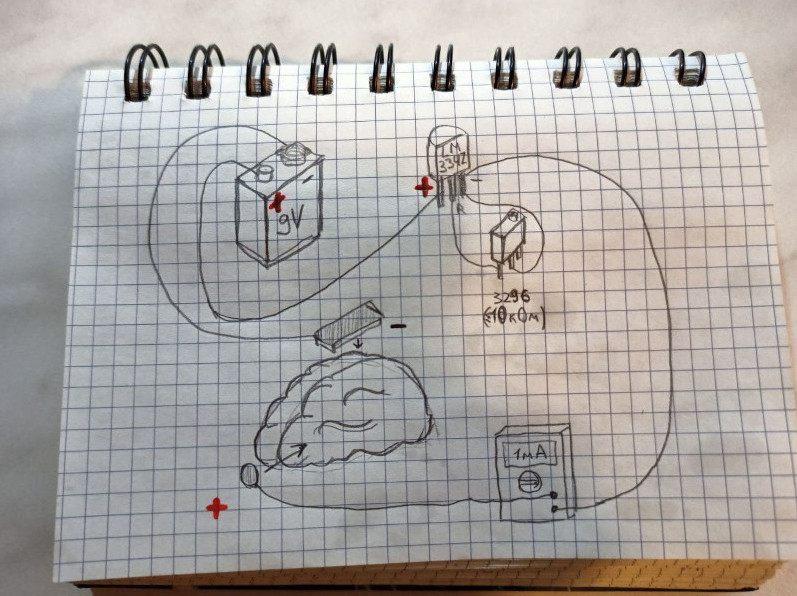
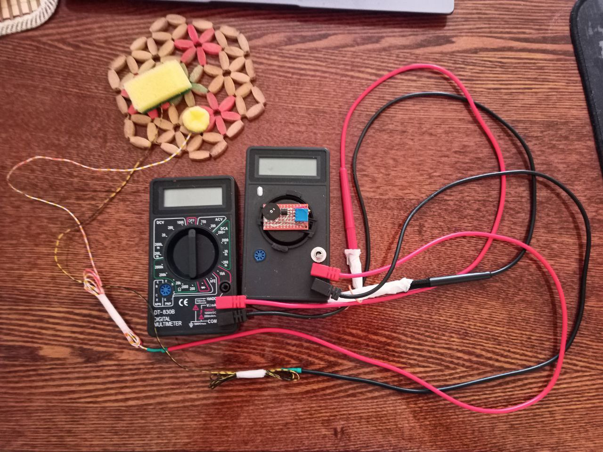

# Что должно быть в хорошей tDCS
Периодически использую tDCS на себе и пришёл вот к каким выводам:
1. В хорошая tDCS должна иметь миллиамперметр. Это вопрос безопасности и/или качества терапии. Если через голову идёт сильно больший ток, чем надо, то нельзя таким устройством пользоваться. Если же меньше (батарейка села, контакт плохой), то я тоже получаю не то, на что рассчитываю. Так что прямой визуальный контроль происходящего - это не просто полезный плюс, а необходимый минимум.
2. Плавный пуск и стоп, в начале сеанса плавно доводим ток до рабочего, в конце плавно уменьшаем до почти нуля. Он же выполняет роль токоограничительного резистора, если не выкручивать его до нулевого сопротивления. Потенциометр в 50кОм в самый раз. Разве что линейный может быть не так удобен как логарифмический, но с логарифмический я пока не тестировал.

Можно добавить таймер, совсем незначительно усложнение, если уже есть контроллер с экраном.

# Предыдущие дизайны
* Попытка сделать дёшево строго на ардуинке на её ЦАП и с обратной связью с помощью её же АЦП https://github.com/e-kolkhoz/tDCS_arduino_simplest. Тут в целом не полный бред, но мощности ардуинки скорее всего хватать не будет, да и попытки использовать компьютер, чтобы отслеживать процесс - слабая идея, годится больше для образовательных целей? не более того.
* Использование в качестве стабилизатора тока lm334z (и подстроечный резистор для его настройки) и отдельного мультиметра (DT-830B годится) в качестве миллиамперметра - неудобно, но вполне прилично. Я считаю, что надёжный стабилизатор тока lm334z - это до сих пор отличный выбор. Тут не хватало потенциометра плавного пуска, если не забывать про миллиамперметр, то рабочий вариант.

* Попытки засунуть tDCS в корпус мультиметра (контакты выбора режима пропаиваются насмерть на миллиамперметр, лишнее из корпуса вытряхивается). Не удалось использовать миллиамперметр и tDCS с одной батарейки в одном корпусе, нужны независимые две батарейки, потому пока использовал два устройства. А в итоге от предыдущей схемы отличается только появлением дополнительного потенциометра для плавного пуска/стопа (чёрный барашек на 100кОм в данном случае).

# Текущий прототип

Прототип отличный, есть недостатки в компановке, но в целом в практическом плане всё идеально.
Импровизированный цифровой миллиамперметр, оказался вполне чувствительным, компактным и дешевым.

OLED дисплей 0.96" 128x64 на SSD1306, I2C

В качестве контроллера решено было взять attiny85 в модуле от digispark (точнее, его клон).

Cложности:
1. Мало ног. Если ставить экранчик, SSD1306 OLED дисплей 0.96" 128x64, I2C, то со включенным USB будет артефачить, а свободных аналоговых входов не останется, придется использовать пин reset в качестве аналогового входа (см п. 4)
2. Странно прошивается, он не изображает usbtty (или com port) как простые ардуинки nano, а мимикрирует под USB устройство. Надо отправить скетч на заливку, а потом воткнуть контроллер в USB
3. Что-то безумное с прошивками. Относительно легко превратить контроллер в кирпич или полукирпич из-за неаккуратной прошивки.
4. 100% потребуется ещё одна ардуинка в качестве ArduinoISP, скажем нано, и конденсатор 10мкФ потому что скоро придется attiny85 перепрошивать и отключать Reset на пине PB5. Т.е. придется PB5 превращать в GPIO, и в случае критической ошибки перепрошить программатором уже не получится (нужно будет собирать высоковольтный программатор HVSP/HVPP), так что ошибаться будет нельзя, нельзя грузить скетч, который вызовет какое-нибуть зависание контроллера или отвал USB контроллера. Но я ошибался пару раз, потому стоит набирать модулей attiny85 с запасом или вообще с ними не связываться.

Чтобы влезло два шрифта, пришлось один из них хакать, колдовать с битами кодирования символов, что забавно, но муторно, там по коду видно, где я в этом упражнялся.

Враждебность и непредсказуемость attiny85 в разы выше, чем у обычных ардуин. Если б я знал как жестко буду буксовать, взял бы что-то вроде Arduino Pro Mini и занизил бы частоту для энергоэффективности.

tDCS.ino - это скетч для attiny85, по сути это код для миллиамперметра и таймера, а стабилизатор тока - всё тот же lm334z.
